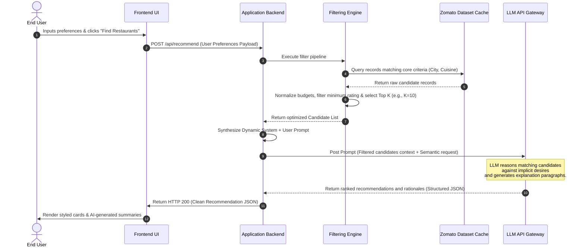

# System Architecture Document: AI-Powered Restaurant Recommendation System

This document outlines the detailed system architecture, component decomposition, data models, and communication flows for the **AI-Powered Restaurant Recommendation System** (inspired by Zomato).

---

## 🏛️ Architectural Overview & Design Goals

To deliver a scalable, cost-efficient, and highly responsive system, the architecture is guided by three main design principles:
1. **Decoupled Processing**: Separation of data preprocessing/ingestion, fast metadata filtering, and semantic LLM synthesis.
2. **Token Economy**: Dynamic pre-filtering ensures that the LLM is supplied with a highly relevant, size-optimized subset of restaurant data rather than raw, unpruned tables.
3. **Structured Integration**: Interfaces between components utilize standard schema formats, allowing easy swaps of datasets, UI libraries, or LLM providers.

---

## 🧩 Component Decomposition

The system is decomposed into four main architectural layers:

```
+-------------------------------------------------------+
|                    Client Layer                       |
|           (Web Dashboard / User Interface)            |
+---------------------------+---------------------------+
                            |
                            v (HTTPS Payload)
+---------------------------+---------------------------+
|                  Application Core Layer               |
|      (Routing, State Management, Request Handling)    |
+---------------------------+---------------------------+
                            |
        +-------------------+-------------------+
        |                                       |
        v (Local Query)                         v (API Payload)
+-------+---------------+               +-------+---------------+
|    Filtering Engine   |               |   LLM Orchestrator    |
|   (Data / Pre-Filter) |               |  (Prompt & Inference) |
+-------+---------------+               +-------+---------------+
        |                                       |
        v                                       v
+-------+---------------+               +-------+---------------+
| Zomato Dataset Cache  |               |  External LLM Provider|
| (Memory/JSON/SQLite)  |               |        (Groq)         |
+-----------------------+               +-----------------------+
```

### 1. Presentation Layer (Client UI)
* **Responsibility**: Capture structured input preferences (e.g., location, budget, ratings) and text-based implicit inputs (e.g., "quiet, romantic spot"). Renders the recommendations using a card-based layout featuring semantic explanations.
* **Tech Stack**: Vanilla HTML/JavaScript with dynamic CSS for fluid animations and transitions, or a lightweight frontend framework.

### 2. Filtering & Ingestion Engine (Data Layer)
* **Responsibility**: Loads the Hugging Face Zomato dataset, cleans incomplete records, and maintains a fast, in-memory local cache. Performs deterministic filtering (strict matching on city, budget, and cuisine) to crop the candidate set to a manageable size ($N \le 20$) before it goes to the LLM.
* **Fields Cleaned**: Budget normalization (converting average price into Low/Medium/High tiers), rating standardization, and location spelling normalization.

### 3. LLM Orchestrator (Cognitive Layer)
* **Responsibility**: Performs prompt synthesis by blending user preferences and pre-filtered candidate data. Handles external API communication with the LLM provider, manages timeouts, and parses raw text responses back into structured formats.
* **Resiliency**: Built-in retry logic for rate limits and malformed outputs.

---

## 🔄 Dynamic Data Flow Sequence

The sequence diagram below displays the step-by-step communication lifecycle of a recommendation request:



---

## 🗄️ Core Data Models & Schemas

### 1. Dataset Record Schema (Input Data)
```json
{
  "restaurant_name": "string",
  "city": "string",
  "cuisines": "array of strings",
  "average_cost_for_two": "integer",
  "normalized_budget_tier": "string (Low | Medium | High)",
  "aggregate_rating": "float",
  "user_reviews": "array of strings",
  "has_online_delivery": "boolean"
}
```

### 2. Preference Payload (User Request)
```json
{
  "location": "string",
  "budget": "string (Low | Medium | High)",
  "cuisine": "string",
  "min_rating": "float",
  "additional_notes": "string"
}
```

### 3. System Output Schema (API Response)
```json
{
  "summary": "string (General overview statement from the AI)",
  "recommendations": [
    {
      "rank": "integer",
      "name": "string",
      "cuisine": "string",
      "rating": "float",
      "estimated_cost_for_two": "integer",
      "ai_explanation": "string"
    }
  ]
}
```

---

## 📝 Prompt Architecture Design

The prompt format represents a key pillar of the recommendation quality. The orchestrator synthesizes the prompt using the following structure:

```
========================= SYSTEM INSTRUCTIONS =========================
You are an elite, local food guide and culinary recommender. 
Your objective is to review a provided list of candidate restaurants and rank the top 3-5 that match the user's explicit limits and semantic wishes.

CRITICAL INSTRUCTIONS:
1. Only recommend restaurants from the provided "Candidate List". Do not invent restaurants.
2. Provide a 2-3 sentence personalized explanation for each, specifically describing how it satisfies their semantic notes (e.g., if they asked for 'romantic', highlight seating/lighting details).
3. Respond in strict JSON matching this exact output structure:
{
   "summary": "Short overview text",
   "recommendations": [{"rank": 1, "name": "...", "cuisine": "...", "rating": 4.5, "estimated_cost_for_two": 800, "ai_explanation": "..."}]
}

======================== CANDIDATE LIST CONTEXT ========================
[
   {"name": "Trattoria Uno", "city": "Bangalore", "cuisines": ["Italian", "Pizza"], "cost": 1200, "rating": 4.2, "reviews": ["Beautiful garden layout...", "Quiet and charming ambiance."]},
   {"name": "Quick Wok", "city": "Bangalore", "cuisines": ["Chinese", "Fast Food"], "cost": 400, "rating": 3.9, "reviews": ["Fast, hot, and cheap...", "Loud environment."]}
]

========================= USER PREFERENCES =========================
- Target City: Bangalore
- Desired Cuisine: Italian
- Budget Level: Medium (Cost range: 800-1500)
- Min Rating: 4.0
- Semantic Desires: "I want a quiet place for an anniversary date."

========================================================================
```

---

## ⚡ Performance, Cost & Latency Strategy

> [!IMPORTANT]
> **Mitigating LLM Processing Bottlenecks**
> * **Dataset Indexing**: Build an index on the dataset by `Location` and `Cuisine` to perform fast programmatic slicing under 15ms.
> * **Candidate Pruning**: Never send more than **10 candidate restaurants** to the LLM. If the programmatic filter produces more, sort them by `rating` or `reviews_count` and take the top 10.
> * **Local Cache**: Cache identical query payloads using redis or local storage to eliminate redundant API calls for recurring searches.
