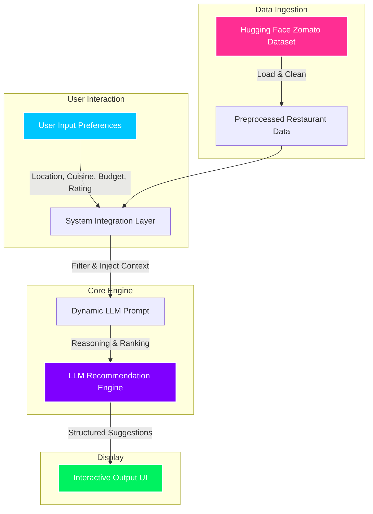

# Context: AI-Powered Restaurant Recommendation System (Zomato Use Case)

This document provides a comprehensive overview of the context, objectives, system architecture, and core requirements for the **AI-Powered Restaurant Recommendation System**, inspired by Zomato.

---

## 🎯 Project Objective

The primary goal is to build an intelligent, personalized restaurant recommendation service that goes beyond traditional rule-based filtering. By combining structured restaurant datasets with the semantic reasoning capabilities of a **Large Language Model (LLM)**, the system will deliver highly tailored, human-like recommendations based on explicit and implicit user preferences.

---

## 🏗️ System Architecture & Workflow

The system is designed around a multi-stage pipeline, processing raw restaurant data and user preferences to generate context-aware suggestions.

---

## 📋 Detailed Functional Requirements

### 1. Data Ingestion & Preprocessing
* **Source Dataset**: Zomato Restaurant Recommendation dataset hosted on Hugging Face ([ManikaSaini/zomato-restaurant-recommendation](https://huggingface.co/datasets/ManikaSaini/zomato-restaurant-recommendation)).
* **Target Schema**: 
  * `Restaurant Name`
  * `Location` (City/Area)
  * `Cuisine`
  * `Cost` (Average cost for two)
  * `Rating` (Aggregate rating)
  * Other descriptive attributes (e.g., dining type, reviews, online order status)

### 2. User Preference Collection
The application must gather the following inputs from the user:
* 📍 **Location**: Target city or specific locality (e.g., Delhi, Bangalore).
* 💰 **Budget**: Categorized into price tiers (Low, Medium, High).
* 🍳 **Cuisine**: Preferred culinary style (e.g., Italian, Indian, Chinese).
* ⭐ **Minimum Rating**: Threshold rating (e.g., 4.0+).
* ✍️ **Additional Preferences**: Implicit/semantic desires (e.g., "romantic date night", "family-friendly", "quick service", "rooftop seating").

### 3. Integration & Filtering Layer
To optimize performance, latency, and LLM token usage:
1. **Pre-filtering**: Narrow down the Zomato dataset programmatically using hard criteria (e.g., matching Location and Cuisines).
2. **Prompt Synthesis**: Format the matching restaurant options into a structured context and inject them into a dynamically generated LLM prompt along with the user's implicit preferences.

### 4. AI Recommendation & Reasoning Engine
Leverage the LLM to:
* **Rank**: Order the filtered restaurants dynamically based on how well they align with both explicit criteria and semantic preferences.
* **Explain**: Write custom, persuasive, and context-aware justifications explaining *why* each restaurant fits the user's specific request.
* **Summarize**: Provide a short, welcoming summary of the culinary journey recommended.

### 5. Output Presentation
Present recommendations cleanly with the following details:

| Field | Description |
| :--- | :--- |
| **Restaurant Name** | Official name of the establishment |
| **Cuisine** | Culinary category/categories offered |
| **Rating** | Overall aggregate star rating |
| **Estimated Cost** | Average cost for dining |
| **AI Explanation** | Human-like reasoning highlighting why this fits the preferences |

---

## 🛠️ Key Technical Challenges & Design Considerations

> [!IMPORTANT]
> **Token & Cost Optimization**
> Passing thousands of raw restaurant rows directly into an LLM will lead to token overflow and excessive API latency/cost. Implementing a robust pre-filtering layer is mandatory.

> [!TIP]
> **Semantic Search Integration**
> For advanced search terms (e.g., "cozy vibe"), semantic embedding comparisons on reviews/descriptions can be paired with hard metadata filtering to locate the most relevant candidates before feeding them to the LLM.
