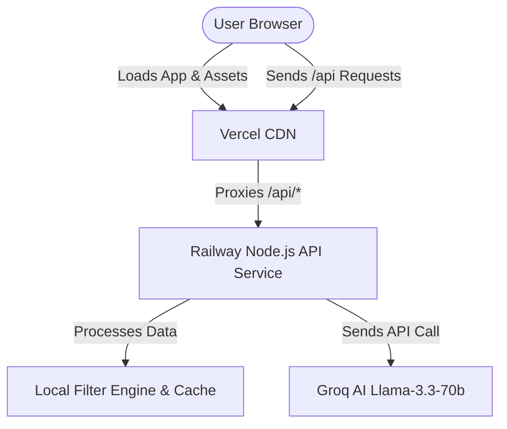

# AI-Powered Zomato Restaurant Recommendation System
## Production Deployment Plan (Vercel & Railway)

This document provides a comprehensive, production-grade deployment plan to split and host the application:
1. **Frontend (Vite + React SPA)** deployed on **Vercel**
2. **Backend API Service (Node.js)** deployed on **Railway**

---

## 🏗️ Architecture Overview

The system is configured in a decoupled architecture where the frontend client interacts with the backend recommendation engine hosted on a separate container environment. 



### Key Technical Details
* **Frontend builds from Root**: The Vite React frontend uses the package structure defined at the repository root. `vite.config.js` is at the root and compiles client resources from `client/` into `public/`.
* **CORS is Pre-Configured**: The backend server in `src/server.js` natively supports preflight `OPTIONS` requests and sets wildcard CORS headers (`Access-Control-Allow-Origin: *`).
* **Request Routing / Proxying**: To prevent mixed-content or CORS issues and avoid hardcoded URLs in client files, we utilize Vercel's Edge Serverless redirects/rewrites to proxy all `/api/*` traffic transparently to the Railway deployment.

---

## 🚄 Part 1: Deploying the Backend on Railway

Railway is an ideal cloud platform to deploy the Node.js API service because it handles continuous deployment directly from your GitHub repository.

### 📋 Prerequisites
* A [Railway Account](https://railway.app/).
* A GitHub repository containing this project.
* A valid **Groq API Key** (obtainable from [Groq Console](https://console.groq.com/)).

### 🛠️ Step-by-Step Backend Deployment

1. **Push Code to GitHub**:
   Ensure all local changes are committed and pushed to your GitHub repository (e.g., `main` branch).

2. **Create a Railway Project**:
   * Navigate to your Railway dashboard and click **New Project**.
   * Select **Deploy from GitHub repo**.
   * Authenticate your GitHub account and select this repository.

3. **Configure Environment Variables**:
   Railway will auto-detect the service. Before building, you must add the environment configuration. Navigate to the **Variables** tab of the service and click **New Variable**:
   
   | Variable Key | Suggested Value | Description |
   | :--- | :--- | :--- |
   | `PORT` | `3000` | The port the Node.js HTTP server listens on. |
   | `LLM_PROVIDER` | `groq` | The target AI provider engine. |
   | `GROQ_API_KEY` | `gsk_...` | **[CRITICAL]** Your live Groq API secret key. |
   | `GROQ_MODEL` | `llama-3.3-70b-versatile` | The optimized model specified for the recommendation pipeline. |

4. **Verify Start Command**:
   Railway auto-detects `npm start` from your `package.json`, which runs:
   ```bash
   node src/server.js
   ```
   This is exactly correct. Railway will automatically build and provision a container for the server.

5. **Generate a Public Domain**:
   * In the service dashboard, go to the **Settings** tab.
   * Under the **Networking** section, click **Generate Domain** (or set up a custom domain).
   * Copy this URL (e.g., `https://zomato-recommendation-service.up.railway.app`). You will need this URL for the Vercel configuration!

---

## ⚡ Part 2: Deploying the Frontend on Vercel

Vercel is optimized for building and hosting modern frontend applications with global CDN performance.

### 📋 Prerequisites
* A [Vercel Account](https://vercel.com/) (connected to the same GitHub account).
* The **Railway URL** from the previous step.

### 🌐 Setup Vercel Reverse Proxy (`vercel.json`)

To enable seamless requests to `/api/recommend` without writing absolute URLs or modifying code in `client/src/App.jsx`, we will add a configuration file called `vercel.json` at the root of our project.

> [!IMPORTANT]
> Create a new file named `vercel.json` in the **root directory** of your repository before pushing to GitHub.

#### Create `vercel.json`:
```json
{
  "version": 2,
  "rewrites": [
    {
      "source": "/api/:path*",
      "destination": "https://YOUR-RAILWAY-BACKEND-URL.up.railway.app/api/:path*"
    }
  ]
}
```
*(Replace `https://YOUR-RAILWAY-BACKEND-URL.up.railway.app` with the real domain Railway generated for your backend service).*

### 🛠️ Step-by-Step Frontend Deployment

1. **Log in to Vercel**:
   Go to the Vercel dashboard and click **Add New** -> **Project**.

2. **Import Repository**:
   Choose the Git repository containing your project.

3. **Configure Project Settings**:
   Vercel requires specific build configurations because our React project uses a root-level workspace layout:

   * **Project Name**: `zomato-tastefinder`
   * **Framework Preset**: `Vite` (or `Other` / auto-detected)
   * **Root Directory**: `.` (Leave as default root)
   * **Build & Development Settings**:
     Toggle the switches to override the default settings:
     * **Build Command**: `npm run build:client`
     * **Output Directory**: `public` *(Crucial: This is the directory where Vite outputs build files according to `vite.config.js`)*
     * **Install Command**: `npm install` (default)

   > [!WARNING]
   > Make sure the **Output Directory** is set to `public`, not `dist`. The Vite config in this project compiles all files into the `public` directory at the root level.

4. **Deploy**:
   Click **Deploy**. Vercel will clone the repo, run `npm install`, execute `npm run build:client`, and host the contents of `public` globally.

---

## 🧪 Part 3: Verification & Smoke Testing

Once both systems are deployed, verify the configuration:

1. **Verify CORS preflight**:
   Make an HTTP `OPTIONS` request to your Railway URL to confirm CORS headers are returned:
   ```bash
   curl -i -X OPTIONS https://YOUR-RAILWAY-BACKEND-URL.up.railway.app/api/recommend
   ```
   Confirm that `Access-Control-Allow-Origin: *` is present in the response headers.

2. **Verify Frontend Application**:
   * Open the Vercel deployment URL in your browser.
   * Fill out the TasteFinder form (e.g., location: "Indiranagar", budget: "Medium", rating: "4.0").
   * Click **Get recommendations** and observe the loading skeleton.
   * Verify that recommendations are retrieved successfully and displayed on the screen.
   * Open your browser's DevTools Network tab and confirm that the request was successfully sent to the relative path `/api/recommend` and handled transparently by Vercel with a `200 OK` status.

---

## 🛡️ Production Optimizations & Troubleshooting

### 1. Mixed Content Errors
If the Vercel page is loaded over HTTPS, but the API request is directed to an HTTP backend, the browser will block the call.
* **Solution**: Ensure your rewrite destination in `vercel.json` explicitly uses `https://`.

### 2. Cache Invalidation and Restarts
The backend service operates an in-memory TTL-based LRU Cache. If you change restaurant candidate data in `data/`, the cache will still serve old results for up to 1 hour.
* **Solution**: Redeploy or restart the Railway service to wipe the in-memory cache and fetch fresh configurations.
